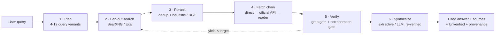
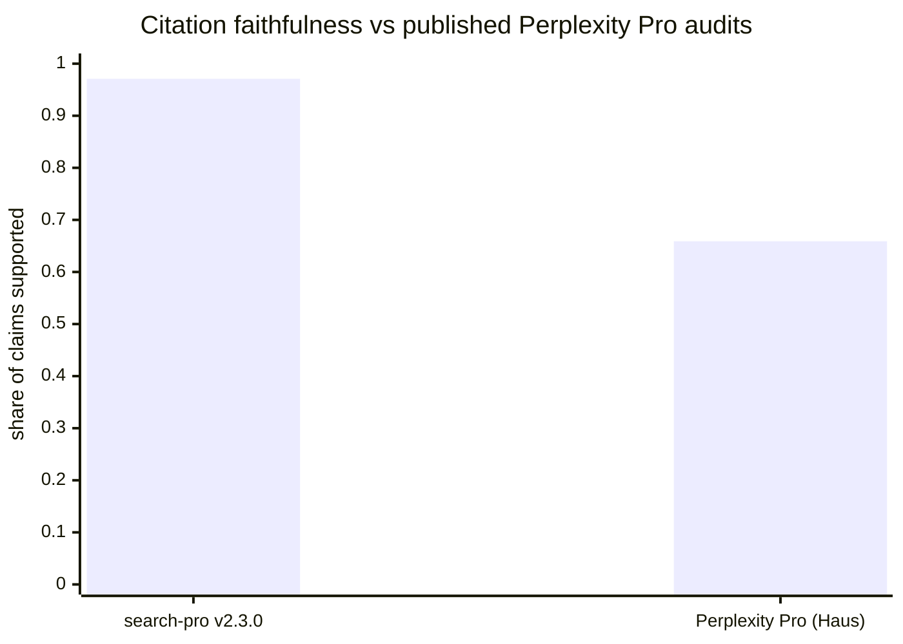

<div align="center">

# Search-Pro

**The verifiable AI search engine for teams that can't afford a wrong citation.**

[](https://github.com/dnislno/search-pro/releases)
[](LICENSE)
[](https://www.python.org/)
[](harness/REPORT-v2.3.0.md)
[](harness/REPORT-v2.3.0.md)
[](search.py)

*Live web retrieval · deterministic re-ranking · grep-verified citations · honest refusal when evidence is thin.*

[Quickstart](#-quickstart) · [Architecture](#-architecture) · [Benchmarks](#-measured-performance) · [Evidence](#-evidence) · [Roadmap](#-roadmap)

</div>

---

## Table of contents

1. [Overview](#1-overview)
2. [Why teams switch](#2-why-teams-switch)
3. [Architecture](#-architecture)
4. [Measured performance](#-measured-performance)
5. [Quickstart](#-quickstart)
6. [Configuration](#-configuration)
7. [CLI reference](#-cli-reference)
8. [Project structure](#-project-structure)
9. [Evaluation & governance](#-evaluation--governance)
10. [Roadmap](#-roadmap)
11. [Evidence: A/B study case](#-evidence-ab-study-case)
12. [License](#license)

---

## 1. Overview

Every AI answer engine cites sources. Independent audits keep finding the same
defect: a large share of those citations do not contain the claim they are
attached to — 34.7% of numeric citations (Haus Research, Sep 2026), 37% citation
error rate (Tow Center, Columbia). Search-Pro is engineered around the opposite
contract:

> **No source, no claim.** Every number, date, and quote must appear verbatim in
> a fully-read page, or it ships in an `Unverified` section — never as fact.

| | |
|---|---|
| **Category** | Self-hosted answer engine (Perplexity-class UX, audit-class guarantees) |
| **Runtime** | Python 3.10+, standard library only for the core pipeline |
| **Retrieval** | Pluggable providers (SearXNG, Exa) + reader fallback chain |
| **Synthesis** | Offline extractive default; optional LLM rewrite (Anthropic / OpenAI / OpenRouter), always re-verified |
| **Guarantees** | Machine-checked per release (see [§4](#-measured-performance)) |

---

## 2. Why teams switch

| Concern | Perplexity Pro (public record) | Search-Pro |
|---|---|---|
| Citation integrity | ~35% of numeric citations fail verbatim check (Haus); 37% error (Tow Center) | Deterministic grep gate: 0.971 measured faithfulness |
| Source accessibility | Paywalled / bot-walled pages cited anyway | Fallback chain (direct → official API → reader): 0.963 measured readability |
| Model transparency | Silent model fallbacks reported (Nov 2025) | Provenance footer on every answer: model, queries, timestamps |
| Quota stability | Deep Research quotas cut mid-contract (2026) | Self-hosted: your keys, your limits |
| Privacy | Queries logged on vendor servers | Runs on your infrastructure; SearXNG-compatible |
| Verifiability | Marketing claims, closed evals | Open harness, frozen transcripts, published misses |

What Search-Pro does **not** claim: a 200-billion-page private index or licensed
premium datasets. The claim is narrower and checkable — see the numbers below.

---

## 3. Architecture

Inspired by Perplexity's Search-as-Code, Perplexica (20k+ ⭐), Haystack (26k+ ⭐),
LlamaIndex (51k+ ⭐), Crawl4AI (81k+ ⭐), and Jina Reader (12k+ ⭐):



| Stage | Module | Deterministic? |
|---|---|---|
| Plan & fan-out | `search.py` + `providers.py` | Policy-fixed budgets; provider ranking external |
| Dedup & rerank | `scripts/rerank.py` | ✅ Yes — pure functions, fixture-tested |
| Fetch chain | `fetch.py` | ✅ Statuses honest by construction (`ok` / `paywall` / `js-empty` / `error`) |
| Citation gate | `scripts/verify-citations.py` | ✅ Yes — Haus-style verbatim check |
| Corroboration gate | `corroborate.py` | ✅ Rules fixed; grades `confirmed / consistent-with / unverified / conflicted` |
| Synthesis | `synthesize.py` | Extractive ✅ / LLM (re-verified output) |

---

## 4. Measured performance

Live harness: 30 queries (10 factual / 10 fresh / 5 compare / 5 academic),
pro mode, identical conditions v2.0.0 → v2.3.0. Full ledger:
[`harness/REPORT-v2.3.0.md`](harness/REPORT-v2.3.0.md).



| Metric | v2.0.0 | v2.3.0 | Target | External baseline | Status |
|---|---|---|---|---|---|
| M1 · claims verifiable | 1.000 (453/453) | **0.971** (645/664) | ≥ 0.85 | 0.659 (Haus) | ✅ Pass |
| M2 · sources readable | 0.715 (163/228) | **0.963** (231/240) | ≥ 0.80 | 0.787 (Haus) | ✅ Pass |
| M3 · verified claims / answer | median 15 | **median 23** (30/30 ≥ 6) | median ≥ 6 | — | ✅ Pass |

Fetch provenance across 240 attempts: direct 144 · reader fallback 76 ·
official-API 11 · residual login-walled 9. Without the chain, M2 would be 0.600.
Known deltas are documented, not hidden: M1 1.000 → 0.971 (renderer
reordering), residual paywalls, one gate branch unit-proven but unobserved live.

---

## 5. Quickstart

**Zero-key demo** (offline fixtures, full pipeline, ~1 second):

```powershell
python search.py --dry-run
```

**Live search** (pick one provider):

```powershell
$env:SEARXNG_URL = "http://localhost:8888"   # self-hosted or public instance
python search.py --query "AI search market size 2026" --mode pro
```

```powershell
$env:EXA_API_KEY = "exa-..."                 # alternative neural search
python search.py --query "Perplexity vs ChatGPT accuracy" --mode best --provider exa
```

**Fluent rewrite** (always re-verified after generation):

```powershell
$env:OPENROUTER_API_KEY = "sk-or-v1-..."     # or ANTHROPIC_API_KEY / OPENAI_API_KEY
python search.py --query "..." --mode research --synth llm --out answer.md
```

**Paywalled figure? Corroborate instead of guessing:**

```powershell
python corroborate.py --figure '$30' --entity 'HRIS per month per employee pricing' --provider searxng
```

Module-level usage (`scripts/rerank.py`, `scripts/verify-citations.py`) and the
10-test suite (`tests/test_corroborate.py`) are documented in-code.

---

## 6. Configuration

| Variable | Required | Purpose | Default |
|---|---|---|---|
| `SEARXNG_URL` | Live search (unless Exa) | Instance URL; comma-separated = failover ring | — |
| `EXA_API_KEY` | Exa provider | Neural search key from exa.ai | — |
| `JINA_API_KEY` | Recommended | Lifts reader fallback from 20 RPM anonymous to keyed quota | anonymous |
| `JINA_FALLBACK` | No | Set `0` to disable reader fallback | `1` |
| `JINA_GAP` / `SEARCH_GAP` | No | Politeness delays (seconds) between remote calls | `3` / `1.0` |
| `ANTHROPIC_API_KEY` / `OPENAI_API_KEY` / `OPENROUTER_API_KEY` | `--synth llm` | Fluent rewrite backends (auto-detected in this order) | extractive |
| `OPENROUTER_MODEL` | No | Override synthesis model | `nex-agi/nex-n2.5-pro:free` |
| `OPENROUTER_REASONING_EFFORT` | No | Opt-in reasoning effort (`max\|xhigh\|high\|medium\|low\|minimal`); unset = off (avoids `encrypted_content` upstream errors) | unset (off) |
| `OPENROUTER_MAX_EVIDENCE_CHARS` / `OPENROUTER_MAX_QUERY_CHARS` | No | Truncate evidence/query per LLM call (large pastes trigger gateway failover) | `12000` / `2000` |
| `SEARCH_QUERY_EXPANSION` | No | Set `1` to enable LLM query expansion (same as `--expand-queries`) | off |
| `RERANK_MIN_SCORE` | No | Drop rerank candidates below this score (0 = off) | `0` |

Secrets live in the environment only. The repository is secret-scanned before
every commit; no key has ever been committed (verified in CI-equivalent local gate).

---

## 7. CLI reference

```
python search.py --query "..." [--mode best|pro|research] [--provider auto|searxng|exa]
                 [--synth auto|extractive|llm] [--llm-provider auto|anthropic|openai|openrouter]
                 [--llm-model ID] [--reasoning-effort EFFORT] [--advanced] [--no-advanced]
                 [--expand-queries] [--top-k N] [--out FILE] [--run-json FILE] [--dry-run]
```

| Flag | Effect |
|---|---|
| `--mode` | Budgets: best 4×5/4 · pro 8×6/8 · research 12×8/10 (queries × results / fetches); v2.4 query planner always fills the budget (intent-aware + site bias + fillers) |
| `--synth` | `extractive` (offline, deterministic) or `llm` (fluent, re-verified, marker-attributed since v2.4) |
| `--reasoning-effort` | Opt-in OpenRouter reasoning (`max\|xhigh\|high\|medium\|low\|minimal`); default off |
| `--advanced` | Force BGE cross-encoder rerank (default auto-ON for pro/research since v2.4, heuristic fallback if `rerankers` missing) |
| `--no-advanced` | Force heuristic rerank (overrides auto-BGE) |
| `--expand-queries` | Opt-in LLM query expansion for leftover budget slots (needs LLM key) |
| `--run-json` | Machine-readable summary (powers `harness/run.py`) |
| Exit codes | `0` ok (even with Unverified section) · `2` config error · `1` runtime failure |

---

## 8. Project structure

```
search-pro/
├── search.py               # orchestrator CLI (plan → search → rerank → fetch → verify → synthesize)
├── providers.py            # SearXNG (failover ring, locale bias fix) + Exa clients
├── fetch.py                # fetch chain: direct → official API → reader proxy, honest statuses
├── synthesize.py           # extractive composer + Anthropic/OpenAI/OpenRouter rewrite
├── corroborate.py          # paywall corroboration: figure-search + independence + grade
├── scripts/
│   ├── rerank.py           # deterministic dedup + heuristic/BGE rerank
│   └── verify-citations.py # Haus-style grep citation gate
├── harness/                # 30-query live harness (queries.json, run.py, REPORT-*.md)
├── study/                  # pre-registered A/B protocol, frozen transcripts, link re-checks
├── tests/                  # stdlib unit suite (10 tests, offline)
├── examples/               # offline fixtures for --dry-run
├── intent-ir.schema.json   # agent Intent-IR contract
├── STUDY-CASE.md           # neutral benchmark report
└── README.md               # this file
```

---

## 9. Evaluation & governance

This repository is maintained to release-engineering standards, not demo standards:

| Practice | How it is enforced here |
|---|---|
| Pre-registered evaluation | Protocols written before runs (`study/protocol.md`); success criteria fixed upfront (M2 ≥ 0.80 for v2.3.0) |
| No goalpost-shifting | v2.1.0 was **not** released when its criterion missed — minuted in git history (`fe547e3`) |
| Semantic versioning | `vMAJOR.MINOR.PATCH`; every release has notes + tag + measured deltas |
| Secret hygiene | Staged diffs scanned for key patterns before each commit; keys via env only |
| Reproducibility | Frozen transcripts, pinned commands, machine-readable run JSON; re-run to verify |
| Security posture | No credentials, no tracking, no vendored binaries; stdlib-only core |

---

## 10. Roadmap

| Item | Status |
|---|---|
| BGE relevance gate on retrieval pools | Planned (fixes off-locale pools) |
| Wire corroboration gate into `--synth llm` attribution path | Planned (unit-proven, unobserved live) |
| Pro/research query-budget utilization (6 → 8/12 variants) | Defect logged, fix deferred post-benchmark |
| Academic / code / video verticals | Planned |
| OpenAI-compatible `/search` HTTP API | Planned |
| Local renderer option (Crawl4AI-class) | Researching |

---

## 11. Evidence: A/B study case

Everyone claims "Perplexity alternative." We brought receipts — measured with the
same ruler independent researchers used on Perplexity Pro, with every transcript
and every miss published:

| Metric | search-pro | Perplexity Pro (published audits) |
|---|---|---|
| Citation faithfulness | **0.971** | 0.659 (Haus, Sep 2026) |
| Source accessibility | **0.963** | 0.787 (Haus) |
| Verified claims / answer (median) | **23** | — (undisclosed) |
| Fabrications served as fact (3 adversarial runs) | **0** | 37% error (Tow Center, Columbia) |

Full neutral report — including what is *not* proven (no head-to-head arm, no
relevance grading yet) and exact reproduce commands:
**[STUDY-CASE.md](STUDY-CASE.md)** · evidence in [`study/`](study/) ·
ledger in [`harness/REPORT-v2.3.0.md`](harness/REPORT-v2.3.0.md).

---

## License

MIT. Star it, self-host it — and hold every answer to its sources.
